### Loan Default Hybrid System - Model Architecture Flowchart

#### System Overview

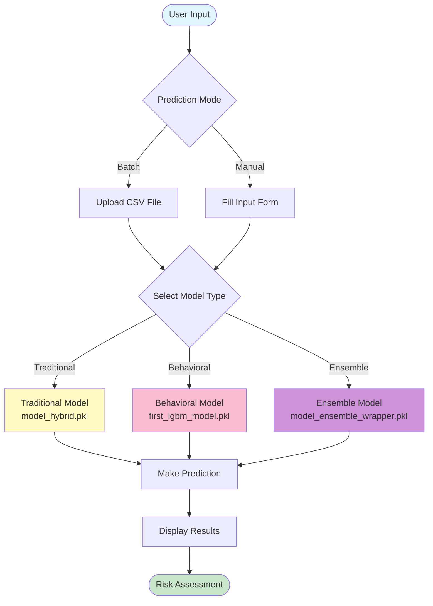

---

### Detailed Model Pipeline

**1. Traditional Model Pipeline (Home Credit Features)**

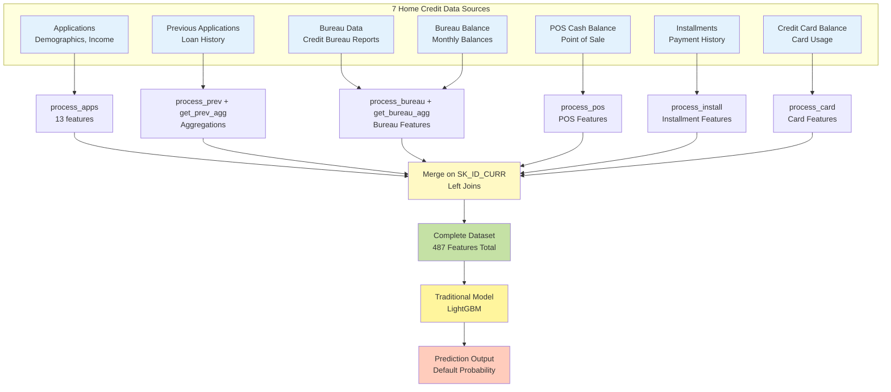

**Traditional Model Flow:**

1. **Input**: 7 Home Credit datasets (applications, previous applications, bureau, bureau balance, POS balance, installments, credit card balance)
2. **Processing**: Multiple feature engineering functions:
   - `process_apps()`: Application features (13)
   - `get_prev_agg()`: Previous loan aggregations
   - `get_bureau_agg()`: Bureau report aggregations
   - `process_pos()`: POS cash balance features
   - `process_install()`: Installment payment features
   - `process_card()`: Credit card balance features
3. **Merge**: Left joins on SK_ID_CURR to create unified dataset
4. **Result**: 487 total features combining all data sources
5. **Model**: LightGBM trained on 487 features
6. **Output**: Default probability (0-1)

---

**2. Behavioral Model Pipeline (UCI Credit Card Features)**

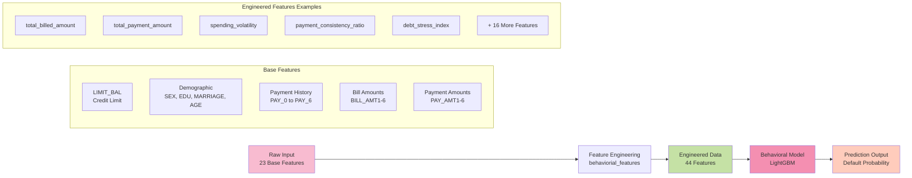

**Behavioral Model Flow:**

1. **Input**: 23 base features from UCI Credit Card dataset
2. **Processing**: `behaviorial_features()` function creates 44 total features (23 base + 21 engineered)
3. **Model**: LightGBM trained on 44 features
4. **Output**: Default probability (0-1)

---

**3. Ensemble Model Pipeline (Hybrid Features)**

```mermaid
graph TB
    Start[Raw Input<br/>Two Data Sources] --> Split{Split by Source}

    Split --> TradPath[Home Credit Data<br/>7 Datasets]
    Split --> BehavPath[UCI Credit Card<br/>23 Base Features]

    TradPath --> TradEng[traditional_features()<br/>Multi-Dataset Pipeline<br/>7 data sources]
    BehavPath --> BehavEng[behaviorial_features<br/>Feature Engineering]

    TradEng --> TradOut[487 Traditional<br/>Features<br/>All HC datasets combined]
    BehavEng --> BehavOut[44 Behavioral<br/>Features]

    TradOut --> Base[Train Base Models]
    BehavOut --> Base

    Base --> Meta[Generate Meta-Features<br/>7 Features]

    Meta --> Combine[Concatenate<br/>All Features]
    TradOut --> Combine
    BehavOut --> Combine

    Combine --> Hybrid[Hybrid Dataset<br/>538 Total Features<br/>7 meta + 487 trad + 44 behav]
    Hybrid --> Ensemble[CatBoost Meta-Learner<br/>model_ensemble_catboost_meta_538.pkl]
    Ensemble --> Result[Final Prediction<br/>Default Probability]

    style Start fill:#e1bee7
    style TradPath fill:#bbdefb
    style BehavPath fill:#f8bbd0
    style Hybrid fill:#c5e1a5
    style Ensemble fill:#ce93d8
    style Result fill:#ffccbc
```

**Ensemble Model Flow:**

1. **Input**: Two distinct data sources
   - 7 Home Credit datasets (for traditional branch)
   - UCI Credit Card dataset (for behavioral branch)
2. **Traditional Branch**:
   - Process all 7 Home Credit datasets through `traditional_features()`
   - Generate 487 traditional features
   - Train LightGBM traditional model
3. **Behavioral Branch**:
   - Apply `behaviorial_features()` to UCI data
   - Generate 44 behavioral features
   - Train LightGBM behavioral model
4. **Generate Meta-Features**: 7 features from base model predictions
   - pred_traditional, pred_behavioral, pred_avg, pred_max, pred_min, pred_diff, pred_ratio
5. **Combine**: Concatenate 7 meta + 487 trad + 44 behav → 538 total features
6. **Meta-Learner**: CatBoost trained on 538 combined features
7. **Output**: Default probability (0-1)

---

## Feature Engineering Details

### Traditional Feature Engineering (`traditional_features()`)

**Multi-Dataset Orchestration Pipeline**

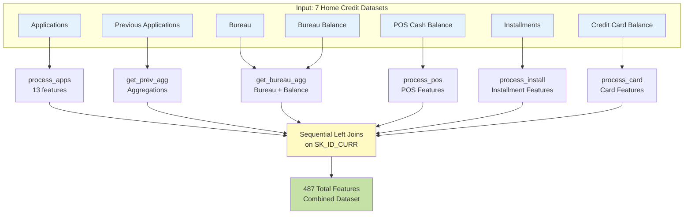

**Feature Categories:**

- **Application Features** (APPS\_\*): 13 features from `process_apps()`
  - Credit score aggregations (EXT_SOURCE mean, std)
  - Financial ratios (credit/income, annuity/income)
  - Temporal ratios (employment/age, income/employment)
- **Previous Loan Features** (PREV\_\*): Aggregated from previous applications
- **Bureau Features** (BUREAU\_\*): Credit bureau data aggregations
- **POS Features** (POS\_\*): Point of sale installment history
- **Installment Features** (INSTALL\_\*): Payment installment records
- **Credit Card Features** (CARD\_\*): Card usage and balance patterns

---

#### Behavioral Feature Engineering (`behaviorial_features`)

```mermaid
graph TD
    Input[23 Base Features] --> FE[Feature Engineering]

    FE --> Cat1[Financial Aggregates<br/>Total Billed Amount<br/>Total Payment Amount<br/>Avg Transaction]
    FE --> Cat2[Volatility Metrics<br/>Spending Volatility<br/>Rolling Balance<br/>Income Consistency]
    FE --> Cat3[Payment Behavior<br/>Payment Consistency<br/>Repayment Ratio<br/>Missed Payment Count]
    FE --> Cat4[Risk Indicators<br/>Debt Stress Index<br/>Credit Utilization<br/>Spend-to-Income Ratio]
    FE --> Cat5[Trend Features<br/>Bill Changes (1-2, 3-4, 4-5)<br/>Credit Utilization Trend]

    Cat1 --> Output[44 Total Features<br/>23 Base + 21 Engineered]
    Cat2 --> Output
    Cat3 --> Output
    Cat4 --> Output
    Cat5 --> Output

    style Input fill:#f8bbd0
    style FE fill:#f48fb1
    style Output fill:#c5e1a5
```

**Feature Categories:**

- **Aggregate Features** (5): total_billed_amount, total_payment_amount, avg_transaction_amount, max_billed_amount, max_payment_amount
- **Volatility Metrics** (8): spending_volatility, income_consistency, bill_change_1_2 through bill_change_5_6, rolling_balance_volatility
- **Financial Stress** (4): net_flow_balance, debt_stress_index, repayment_ratio, missed_payment_count
- **Behavioral Ratios** (3): payment_consistency_ratio, spend_to_income_volatility_ratio, max_to_mean_bill_ratio
- **Trend Features** (1): credit_utilization_trend

---

### Data Flow Architecture

#### Manual Input (Single Applicant)

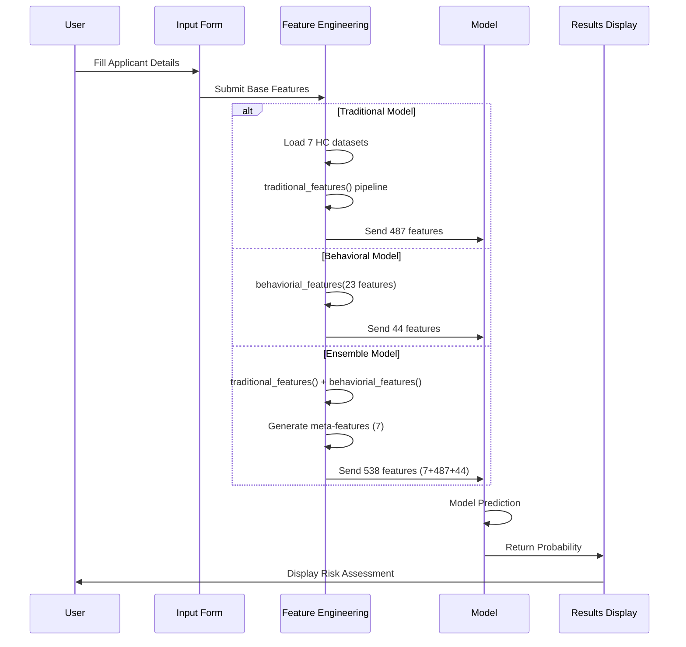

#### Batch Input (CSV Upload)

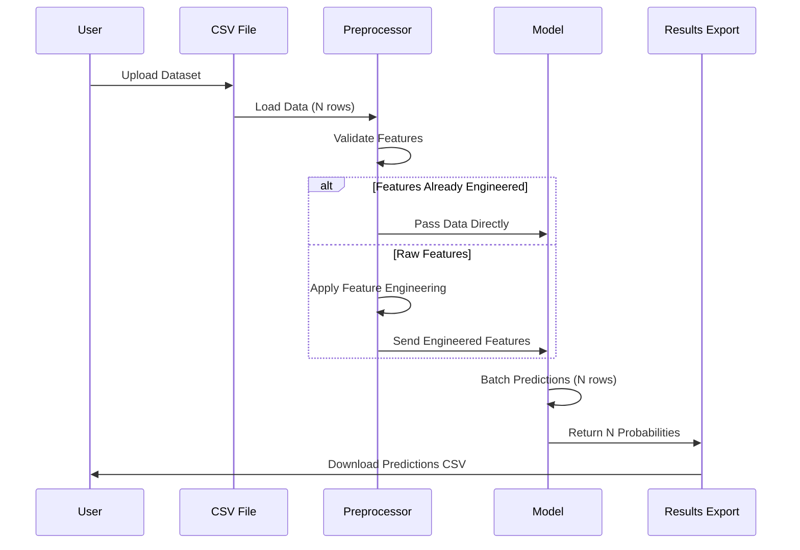

---

### Model Selection Logic

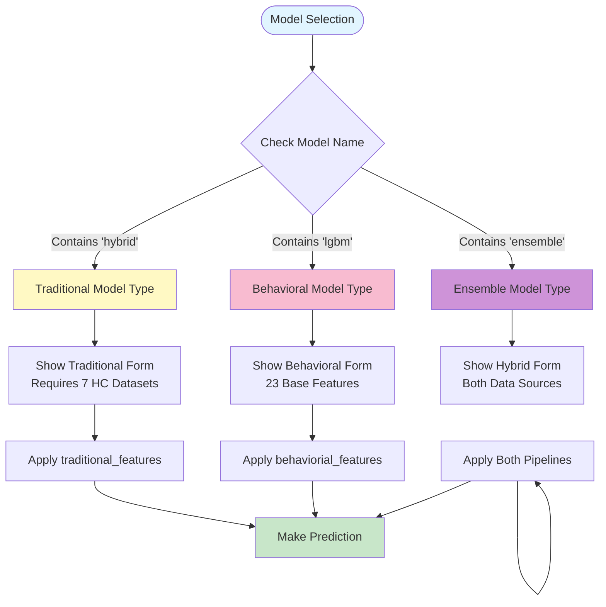

---

### Risk Classification Pipeline

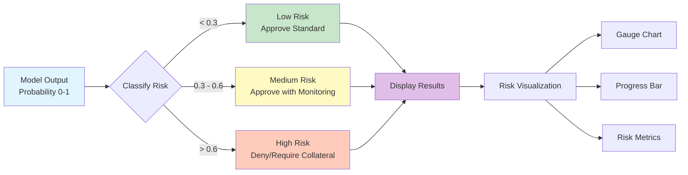

---

### Feature Count Summary

| Model Type      | Data Sources              | Feature Engineering                         | Total Features |
| --------------- | ------------------------- | ------------------------------------------- | -------------- |
| **Traditional** | 7 Home Credit datasets    | Multi-stage aggregation & merging           | **487**        |
| **Behavioral**  | UCI Credit Card (23 base) | Payment & spending patterns (21 engineered) | **44**         |
| **Ensemble**    | Both sources (7 HC + UCI) | 7 meta + 487 trad + 44 behav                | **538**        |

---

### Key Engineering Functions

#### Traditional: `traditional_features()` - Multi-Dataset Pipeline

```python
Input:  7 Home Credit Datasets
        ├── Applications (apps)
        │   └── Demographics, Income, External Scores
        ├── Previous Applications (prev)
        │   └── Historical loan data, approvals, rejections
        ├── Bureau (bureau)
        │   └── Credit bureau reports from other institutions
        ├── Bureau Balance (bureau_bal)
        │   └── Monthly balance history from bureau
        ├── POS Cash Balance (pos_bal)
        │   └── Point of sale installment history
        ├── Installments (install)
        │   └── Payment installment records
        └── Credit Card Balance (card_bal)
            └── Credit card usage and balance history

Processing Pipeline:
        1. process_apps(apps) → 13 application features
        2. get_prev_agg(prev) → Previous loan aggregations
        3. get_bureau_agg(bureau, bureau_bal) → Bureau aggregations
        4. process_pos(pos_bal) → POS features
        5. process_install(install) → Installment features
        6. process_card(card_bal) → Credit card features
        7. Sequential left joins on SK_ID_CURR

Output: 487 total features
        ├── Application features (13)
        │   ├── APPS_EXT_SOURCE_MEAN, APPS_EXT_SOURCE_STD
        │   ├── APPS_CREDIT_INCOME_RATIO, APPS_ANNUITY_INCOME_RATIO
        │   └── APPS_EMPLOYED_BIRTH_RATIO, etc.
        ├── Previous loan aggregations (PREV_*)
        ├── Bureau aggregations (BUREAU_*)
        ├── POS balance features (POS_*)
        ├── Installment features (INSTALL_*)
        └── Credit card features (CARD_*)
```

#### Behavioral: `behaviorial_features(df)`

```python
Input:  23 base features
        ├── LIMIT_BAL, SEX, EDUCATION, MARRIAGE, AGE
        ├── PAY_0, PAY_2, PAY_3, PAY_4, PAY_5, PAY_6
        ├── BILL_AMT1-6 (6 features)
        └── PAY_AMT1-6 (6 features)

Output: 44 features (23 base + 21 engineered)
        ├── Original 23 features
        ├── 21 calculated features:
            ├── total_billed_amount
            ├── total_payment_amount
            ├── avg_transaction_amount
            ├── spending_volatility
            ├── payment_consistency_ratio
            ├── debt_stress_index
            ├── credit_utilization_trend
            ├── missed_payment_count
            └── + 13 additional features (payment patterns, ratios, etc.)
```

---

#### Model Training Architecture

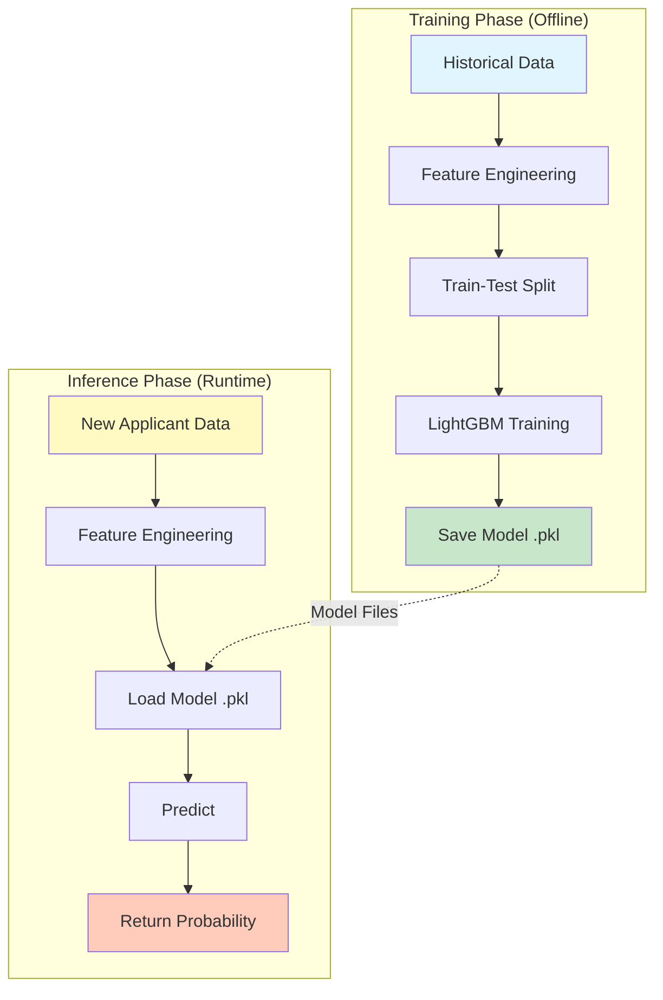

---

#### System Architecture Overview

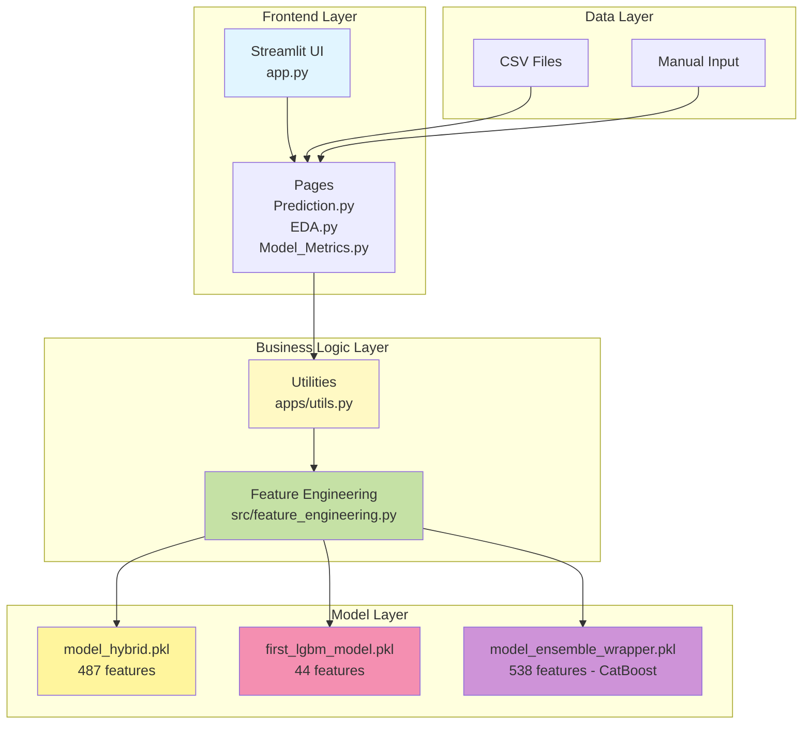

---

---

#### Complete System Architecture

##### Full Application Structure

```mermaid
graph TB
    subgraph "Presentation Layer (Streamlit)"
        App[app.py<br/>Main Entry Point]
        Home[Home.py<br/>Landing Page]
        Pred[Prediction.py<br/>Risk Assessment]
        EDA[EDA.py<br/>Data Analysis]
        FI[Feature_Importance.py<br/>Model Insights]
        MM[Model_Metrics.py<br/>Performance]
    end

    subgraph "Business Logic Layer"
        Utils[apps/utils.py<br/>Model Loading<br/>Predictions<br/>Visualizations]
        FE[src/feature_engineering.py<br/>process_apps()<br/>behaviorial_features()]
    end

    subgraph "Model Layer"
        M1[models/model_hybrid.pkl<br/>Traditional LightGBM<br/>487 features]
        M2[models/first_lgbm_model.pkl<br/>Behavioral LightGBM<br/>44 features]
        M3[models/model_ensemble_wrapper.pkl<br/>Ensemble CatBoost Meta-Learner<br/>538 features]
    end

    subgraph "Data Layer"
        TrainData[Training Data<br/>smoke_engineered.csv<br/>uci_interface_test.csv]
        TestData[Test Data<br/>smoke_hybrid_features.csv]
        UserData[User Uploads<br/>CSV Files]
    end

    subgraph "Configuration"
        Env[Environment<br/>myenv/<br/>Python 3.13]
        Req[Dependencies<br/>requirements.txt]
    end

    App --> Home
    App --> Pred
    App --> EDA
    App --> FI
    App --> MM

    Pred --> Utils
    EDA --> Utils
    FI --> Utils
    MM --> Utils

    Utils --> FE
    Utils --> M1
    Utils --> M2
    Utils --> M3

    FE --> TrainData
    M1 --> TrainData
    M2 --> TrainData
    M3 --> TrainData

    UserData --> Pred
    TestData --> Pred

    Env --> App
    Req --> Env

    style App fill:#4fc3f7
    style Utils fill:#fff59d
    style FE fill:#aed581
    style M1 fill:#ffb74d
    style M2 fill:#f06292
    style M3 fill:#ba68c8
```

---

#### Detailed Component Architecture

##### 1. Frontend Components (Streamlit Pages)

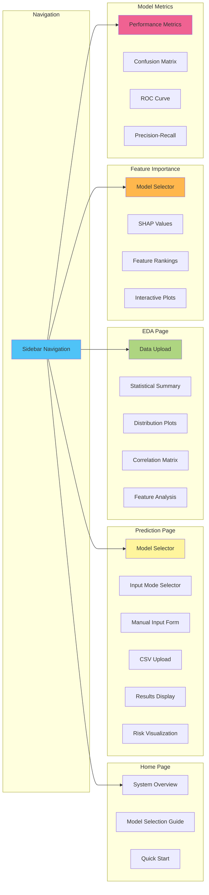

---

##### 2. Business Logic Components

```mermaid
graph TB
    subgraph "apps/utils.py - Core Functions"
        U1[load_model<br/>Load .pkl files]
        U2[get_available_models<br/>Scan models/ directory]
        U3[get_model_type<br/>Identify model category]
        U4[get_predictions<br/>Make predictions]
        U5[align_features<br/>Match model schema]
        U6[classify_risk<br/>Risk categorization]
        U7[plot_gauge<br/>Visualization]
    end

    subgraph "src/feature_engineering.py & src/extract_features.py"
        FE1[traditional_features()<br/>Multi-Dataset Orchestration<br/>7 HC datasets → 487 features]
        FE2[behaviorial_features<br/>Behavioral Engineering<br/>23 → 44 features]
        FE3[Individual Processing Functions<br/>process_apps, get_prev_agg, get_bureau_agg<br/>process_pos, process_install, process_card]
        FE4[Meta-Feature Generation<br/>2 base predictions → 7 features]
    end

    U4 --> U5
    U5 --> U1
    U4 --> FE1
    U4 --> FE2
    FE1 --> FE3
    FE2 --> FE3

    style U1 fill:#4fc3f7
    style U4 fill:#fff59d
    style FE1 fill:#aed581
    style FE2 fill:#f06292
```

---

##### 3. File Structure Tree

```
Loan Default Hybrid System/
│
├── app.py                          # Main Streamlit application
├── requirement.txt                 # Python dependencies
├── MODEL_ARCHITECTURE_FLOWCHART.md # This documentation
├── DATA_FLOW_EXPLANATION.md        # Data flow docs
│
├── myenv/                          # Virtual environment
│   ├── Scripts/                       # Python executables
│   └── Lib/                           # Installed packages
│
├── pages/                          # Streamlit pages
│   ├── Prediction.py                  # Main prediction interface
│   ├── EDA.py                         # Exploratory data analysis
│   ├── Feature_Importance.py          # Feature importance plots
│   └── Model_Metrics.py               # Model performance metrics
│
├── apps/                           # Business logic
│   └── utils.py                       # Core utility functions
│
├── src/                            # Source code
│   └── feature_engineering.py         # Feature engineering functions
│
├── models/                         # Trained models
│   ├── model_hybrid.pkl               # Traditional model (487 features)
│   ├── first_lgbm_model.pkl           # Behavioral model (44 features)
│   ├── model_ensemble_wrapper.pkl     # Ensemble wrapper (538 features)
│   └── model_ensemble_catboost_meta_538.pkl  # CatBoost meta-learner
│
└── data/ (optional)                # Training/test data
    ├── smoke_engineered.csv           # Traditional features
    ├── uci_interface_test.csv         # Behavioral features
    └── smoke_hybrid_features.csv      # Hybrid features
```

---

##### 4. Technology Stack

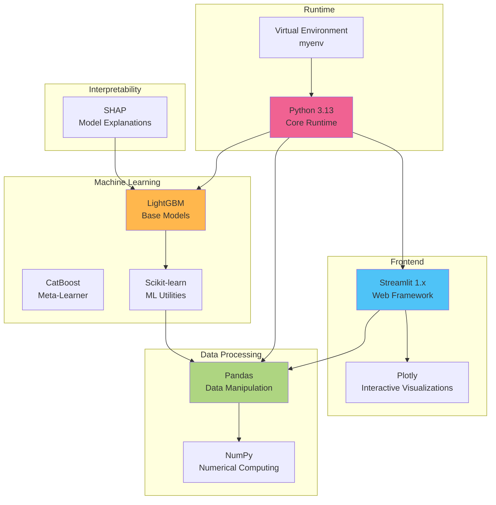

**Key Dependencies:**

- **Streamlit**: Web application framework
- **LightGBM**: Base models (Traditional & Behavioral)
- **CatBoost**: Ensemble meta-learner
- **Pandas**: Data manipulation
- **NumPy**: Numerical operations
- **Plotly**: Interactive visualizations
- **SHAP**: Model interpretability
- **Scikit-learn**: ML utilities

---

##### 5. Request-Response Flow

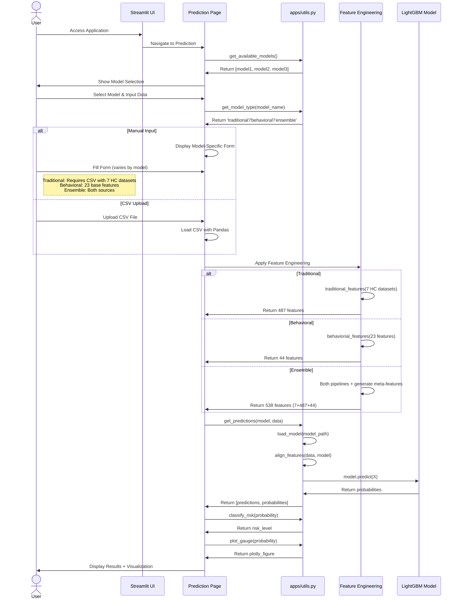

---

##### 6. Data Flow Through System

```mermaid
graph TB
    subgraph "Input Sources"
        I1[Manual Form Input]
        I2[CSV File Upload]
    end

    subgraph "Data Validation"
        V1[Check Required Fields]
        V2[Validate Data Types]
        V3[Check Value Ranges]
    end

    subgraph "Feature Engineering Pipeline"
        FE1{Model Type?}
        FE2[Traditional Pipeline<br/>7 HC datasets → 487]
        FE3[Behavioral Pipeline<br/>23 → 44]
        FE4[Hybrid Pipeline<br/>Both sources → 538<br/>7 meta + 487 trad + 44 behav]
    end

    subgraph "Model Inference"
        M1[Load Model]
        M2[Align Features]
        M3[Predict]
        M4[Calculate Probabilities]
    end

    subgraph "Post-Processing"
        P1[Risk Classification]
        P2[Generate Visualizations]
        P3[Format Results]
    end

    subgraph "Output"
        O1[Display Results]
        O2[Download CSV]
        O3[Show Charts]
    end

    I1 --> V1
    I2 --> V1
    V1 --> V2
    V2 --> V3
    V3 --> FE1

    FE1 -->|Traditional| FE2
    FE1 -->|Behavioral| FE3
    FE1 -->|Ensemble| FE4

    FE2 --> M1
    FE3 --> M1
    FE4 --> M1

    Note right of FE4: Ensemble: 7 meta +<br/>487 trad + 44 behav<br/>= 538 features

    M1 --> M2
    M2 --> M3
    M3 --> M4

    M4 --> P1
    P1 --> P2
    P2 --> P3

    P3 --> O1
    P3 --> O2
    P3 --> O3

    style I1 fill:#e1f5ff
    style FE1 fill:#fff59d
    style M3 fill:#ffb74d
    style O1 fill:#c8e6c9
```

---

##### 7. Model Loading & Caching Strategy

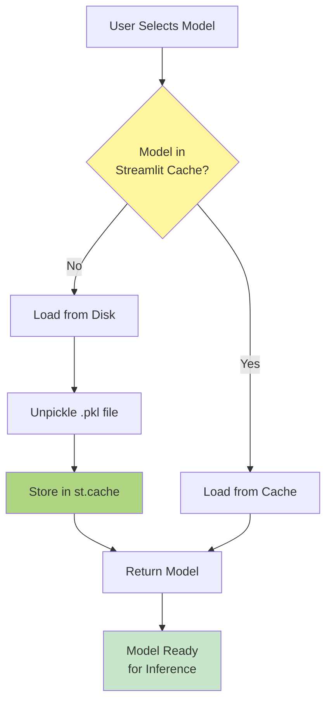

**Caching Benefits:**

- Models loaded once per session
- Faster subsequent predictions
- Reduced memory overhead
- Better user experience

---

##### 8. Error Handling & Validation

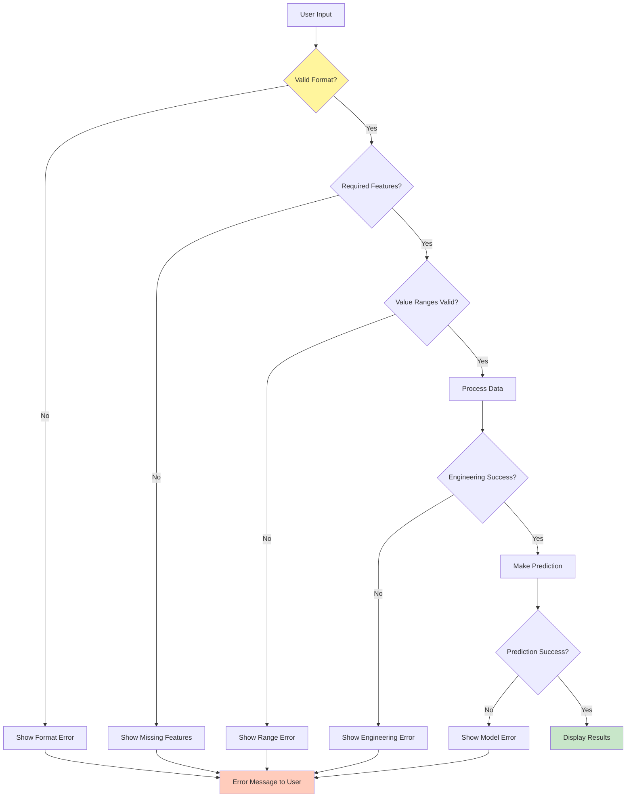

---

#### 9. Deployment Architecture (Production Ready)

```mermaid
graph TB
    subgraph "Client Layer"
        Browser[Web Browser]
    end

    subgraph "Web Server"
        Streamlit[Streamlit Server<br/>Port 8501]
    end

    subgraph "Application Layer"
        App[Python Application<br/>app.py]
        Pages[Page Modules]
        Utils[Utility Functions]
    end

    subgraph "ML Layer"
        Models[Serialized Models<br/>.pkl files]
        FE[Feature Engineering<br/>Functions]
    end

    subgraph "Data Storage"
        Local[Local CSV Files]
        Upload[User Uploads<br/>Temp Storage]
    end

    Browser -->|HTTP| Streamlit
    Streamlit -->|WSGI| App
    App --> Pages
    Pages --> Utils
    Utils --> Models
    Utils --> FE
    FE --> Local
    Pages --> Upload

    style Browser fill:#e1f5ff
    style Streamlit fill:#4fc3f7
    style Models fill:#ffb74d
    style Local fill:#aed581
```

**Deployment Options:**

- **Local**: `streamlit run app.py`
- **Cloud**: Streamlit Community Cloud, Heroku, AWS, Azure
- **Docker**: Containerized deployment
- **Requirements**: Python 3.13, ~500MB models, 2GB RAM minimum

---

#### 10. Security & Performance Considerations

```mermaid
graph LR
    subgraph "Security"
        S1[Input Validation]
        S2[File Type Checking]
        S3[Size Limits]
        S4[No Data Persistence]
    end

    subgraph "Performance"
        P1[Model Caching]
        P2[Lazy Loading]
        P3[Batch Processing]
        P4[Memory Management]
    end

    subgraph "Reliability"
        R1[Error Handling]
        R2[Fallback Values]
        R3[Logging]
        R4[User Feedback]
    end

    style S1 fill:#ffccbc
    style P1 fill:#aed581
    style R1 fill:#fff59d
```

---

### Summary

This hybrid system provides three specialized models:

1. **Traditional Model**: Multi-dataset feature engineering from **7 Home Credit datasets** → 487 features (LightGBM)
   - **Data Sources**: Applications, Previous Applications, Bureau, Bureau Balance, POS Cash Balance, Installments, Credit Card Balance
   - **Pipeline**: Individual feature engineering → Aggregations → Merging on SK_ID_CURR
   - **Functions**: `traditional_features()` orchestrates `process_apps()`, `get_prev_agg()`, `get_bureau_agg()`, `process_pos()`, `process_install()`, `process_card()`
2. **Behavioral Model**: Payment pattern analysis from 23 base features → 44 features (LightGBM)
   - **Data Source**: UCI Credit Card dataset
   - **Pipeline**: Single dataset with behavioral feature engineering
   - **Function**: `behaviorial_features()` creates payment & spending patterns
3. **Ensemble Model**: 3-level stacking architecture → 538 features (CatBoost meta-learner)
   - **Level 0**: Train Traditional (7 HC datasets) & Behavioral (UCI) base models
   - **Level 1**: Generate 7 meta-features from base model predictions
   - **Level 2**: Combine 7 meta + 487 traditional + 44 behavioral = 538 features
   - **Level 3**: Train CatBoost meta-learner on combined features

Each model returns a probability (0-1) representing default risk, which is then classified into Low/Medium/High risk categories for actionable insights.

**Performance (Ensemble Model - Test Set):**

- **AUC-ROC**: 0.8590 (+5.3% improvement)
- **Accuracy**: 81% (+6% improvement)
- **Recall**: 77% (+7% improvement)
- **Precision**: 25%

**Feature Naming Convention:**

- `pred_*`: Meta-features (7) - pred_traditional, pred_behavioral, pred_avg, pred_max, pred_min, pred_diff, pred_ratio
- `trad_*`: Traditional features (487) - prefixed Home Credit features
- `behav_*`: Behavioral features (44) - prefixed UCI Credit Card features

---

#### Ensemble Model Architecture Details

**3-Level Stacking Pipeline:**

```mermaid
graph TB
    subgraph "Level 0: Base Models"
        D1[Training Data] --> TM[Traditional Model<br/>LightGBM<br/>487 features]
        D1 --> BM[Behavioral Model<br/>LightGBM<br/>44 features]
    end

    subgraph "Level 1: Meta-Feature Generation"
        TM --> P1[Traditional Predictions]
        BM --> P2[Behavioral Predictions]
        P1 --> MF[Generate 7 Meta-Features]
        P2 --> MF
        MF --> M1[pred_traditional]
        MF --> M2[pred_behavioral]
        MF --> M3[pred_avg]
        MF --> M4[pred_max]
        MF --> M5[pred_min]
        MF --> M6[pred_diff]
        MF --> M7[pred_ratio]
    end

    subgraph "Level 2: Feature Combination"
        M1 --> Combine[Concatenate Features]
        M2 --> Combine
        M3 --> Combine
        M4 --> Combine
        M5 --> Combine
        M6 --> Combine
        M7 --> Combine
        TF[487 Traditional Features] --> Combine
        BF[44 Behavioral Features] --> Combine
        Combine --> Final[538 Total Features<br/>7 meta + 487 trad + 44 behav]
    end

    subgraph "Level 3: Meta-Learner"
        Final --> CB[CatBoost Meta-Learner<br/>iterations: 1000<br/>learning_rate: 0.05<br/>depth: 6]
        CB --> Output[Final Prediction<br/>Default Probability]
    end

    style TM fill:#ffb74d
    style BM fill:#f06292
    style MF fill:#ce93d8
    style Combine fill:#aed581
    style CB fill:#4fc3f7
    style Output fill:#c8e6c9
```

**Meta-Feature Descriptions:**

- `pred_traditional`: Probability from Traditional model
- `pred_behavioral`: Probability from Behavioral model
- `pred_avg`: Average of both predictions
- `pred_max`: Maximum of both predictions
- `pred_min`: Minimum of both predictions
- `pred_diff`: Absolute difference between predictions
- `pred_ratio`: Ratio of traditional to behavioral predictions

**CatBoost Configuration:**

```python
{
    'iterations': 1000,
    'learning_rate': 0.05,
    'depth': 6,
    'l2_leaf_reg': 3,
    'auto_class_weights': 'Balanced',
    'early_stopping_rounds': 50,
    'random_seed': 42
}
```

**Training Results:**

- Early stopped at iteration 68
- Validation AUC: 0.8442
- Test AUC: 0.8590

---

#### System Highlights:

- **Modular Architecture**: Clean separation of concerns (UI, Logic, Models, Data)
- **Advanced Ensemble**: 3-level stacking with meta-feature generation
- **High Performance**: 85.9% AUC-ROC with balanced precision-recall
- **Scalable Design**: Easy to add new models or features
- **User-Friendly**: Streamlit provides intuitive interface
- **Production-Ready**: Error handling, caching, validation
- **Well-Documented**: Comprehensive flowcharts and architecture diagrams
- **Interpretable**: SHAP integration with dual naming strategy

---

#### Feature Naming & SHAP Compatibility

**Dual Naming Strategy:**

The system uses a dual naming approach to balance CatBoost requirements with interpretability:

1. **Computation Layer (CatBoost):**

   - Uses original feature names without prefixes
   - Required for CatBoost model compatibility
   - Example: `EXT_SOURCE_1`, `LIMIT_BAL`, `pred_traditional`

2. **Display Layer (SHAP & UI):**
   - Adds prefixes for clarity and interpretability
   - Example: `trad_EXT_SOURCE_1`, `behav_LIMIT_BAL`, `pred_traditional`

**Implementation:**

```python
# Feature importance with prefixes
meta_names = ['pred_traditional', 'pred_behavioral', 'pred_avg',
              'pred_max', 'pred_min', 'pred_diff', 'pred_ratio']
feature_names = (meta_names +
                [f'trad_{feat}' for feat in traditional_features] +
                [f'behav_{feat}' for feat in behavioral_features])

# SHAP with dual naming
X_for_shap = pd.concat([meta_features, X_trad, X_behav], axis=1)  # Original names
X_for_display = X_for_shap.copy()
X_for_display.columns = feature_names  # Prefixed names
shap.summary_plot(shap_values, X_for_display, show=False)
```

